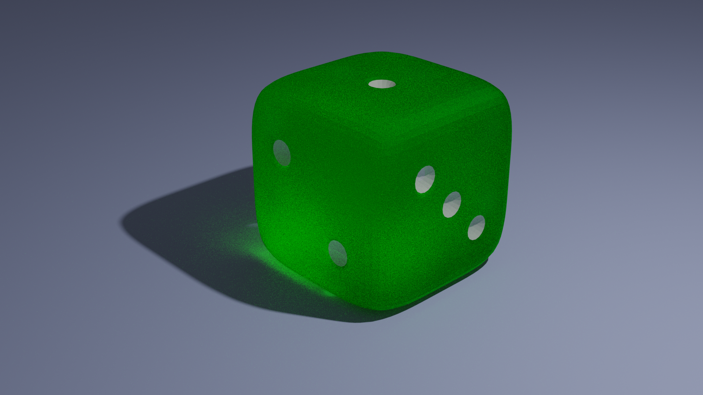
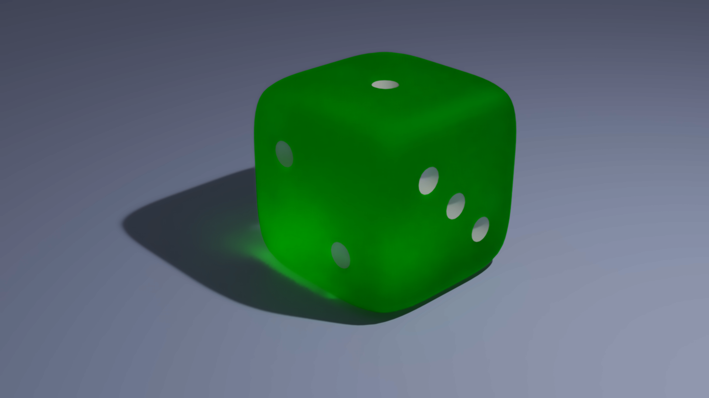

# Python Denoiser

## Usage

You can modify the input and output names to match your image file or you can name your image to "x.png" and then run

```shell
python denoiser.py
```
## Acknowledgements

I used [this guide](https://www.geeksforgeeks.org/python-denoising-of-colored-images-using-opencv/) and [CV2 documentation](https://shimat.github.io/opencvsharp_2410/html/635f2450-96f2-cee1-9d4f-7b2c191c6d1d.htm).

## Notes 

Input image: 



Output image:



### Sidenote

I used this piece of code to denoise a rendered image after fiddling around with Blender and later I found the way how to denoise it in Blender so it was a bit unnecessary but I did it anyway:

